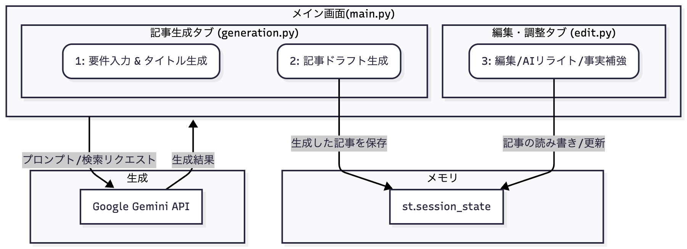

# 📝 LLMOコンテンツ生成アシスタント

## 1. プロジェクト概要 (Project Overview)
AIとの対話とWeb検索による事実補強を組み合わせ、SaaS企業がビジネス目標を達成するための、戦略的なB2Bコンテンツを高速に生成・改善する編集パートナーです。

## 2. 背景と目的 (Background and Goal)

### 背景 (Background)
近年、従来のSEO（検索エンジン最適化）に代わり、LLMO（大規模言語モデル最適化）という新たな概念が注目を集めています。これは、Google検索のように人間が検索結果を選ぶのではなく、ChatGPTやGeminiのような生成AIが、Web上の情報を自ら解釈し、ユーザーへの回答を生成する時代に対応するためのコンテンツ戦略です。

AIに「信頼できる情報源」として引用・参照されやすいコンテンツには、主に以下のような特徴があります。

-   **明確な構造**: 見出しや箇条書きが適切に使われ、情報の階層が整理されている。
-   **事実の正確性と信頼性**: 主張に客観的な根拠や専門的な情報が含まれている。
-   **独自の視点**: 他の情報の受け売りではなく、独自の分析や深い洞察が提供されている。

これらを念頭に置き、以下のシナリオを想定してこのシステムは開発されました。

> **シナリオ:** 急成長中のSaaS企業「CloudFlow Dynamics」のマーケティングチームは、従来のGoogle検索依存から脱却し、ChatGPT、Claude、Gemini等の生成AIが情報検索の主流となる時代に対応する必要があります。しかし、AIに引用されるコンテンツ制作のノウハウが社内になく、手動での試行錯誤に限界を感じています。

このシナリオは、多くのB2B企業が直面している、コンテンツ戦略の転換期における普遍的な課題を象徴しています。

### 目的 (Goal)
この課題を解決するため、本プロジェクトでは**「LLMO（大規模言語モデル最適化）に最適化されたコンテンツを生成・支援するシステム」**を開発することを目的としました。

従来のSEOを主眼に置くのではなく、生成AIに「引用されたい」「参照されたい」と思わせる、高品質で構造化されたコンテンツの企画・制作を自動化することを目指します。

そのために、単に記事を一方的に生成するだけでなく、**人間とAIが協業し、コンテンツの品質を対話的に向上させていく「編集パートナー」**としての体験を設計しました。ユーザーはAIが生成したドラフトに対し、手動での編集はもちろん、自然言語での指示による推敲や、Web検索による事実補強（グラウンディング）を反復的に行うことができます。この一連のワークフローを通じて、最終的にビジネス目標を達成する、信頼性の高いコンテンツを創出します。

## 3. システムアーキテクチャ (System Architecture)
本アプリケーションは、`main.py`をエントリーポイントとし、「記事生成」と「編集・調整」の2つの主要機能を`generation.py`と`edit.py`にモジュール化しています。 タブ間のデータ連携は`st.session_state`を介して行われます。



## 4. 機能一覧 (Features)
本システムは、以下の主要な機能を備えています。

- **要件の事前指定**: 複数のキーワード、記事の概要、文体、おおよその文字数を事前に指定できます。
- **段階的なコンテンツ生成**:
  1.  まず、入力された要件に基づき、AIが10個のタイトル案を生成します。
  2.  ユーザーがその中からタイトルを選択すると、そのタイトルに沿った記事本文のドラフトが生成されます。
- **AIによる反復的なリライト機能**: 生成された記事に対し、ユーザーが自然言語で指示を与えることで、AIが文章を対話的に推敲・調整します。
- **Web検索による事実補強機能（グラウンディング）**: AIが自律的にWeb検索を行い、生成する記事に客観的なデータや事例を引用し、出典を明記することで、コンテンツの信頼性・説得力を向上させます。
- **リアルタイムプレビュー付き編集機能**: ユーザーは、AIが生成・調整した記事を、Markdownのリアルタイムプレビューを見ながら自由に編集できます。

### プロンプトエンジニアリングの工夫 (Prompt Engineering Techniques)
本システムの中核は、高品質なBtoBコンテンツを安定して生成するための、緻密に設計されたプロンプトにあります。以下に、その主要な工夫点を挙げます。

**1. 具体的なペルソナとビジネスゴールの設定**
AIに対し、単に「記事を書いて」と指示するのではなく、「CloudFlow Dynamics社の優秀なコンテンツマーケター」という明確な役割（ペルソナ）を与えています。さらに、「潜在顧客の共感を獲得し、最終的に製品への興味を喚起する」という具体的なビジネスゴールを指示することで、AIの生成するコンテンツが常にビジネス目標に沿ったものになるように制御しています。

**2. 構造化出力の強制による、機械可読性の確保**
タイトル生成においては、「必ず番号付きリスト形式で、タイトルのみを出力すること」といった厳格なフォーマットを要求しています。 これにより、AIの返答が単なる自然言語のテキストではなく、プログラムが容易に解釈・処理できる「データ」となり、後続のUI（ラジオボタンでの選択など）とのスムーズな連携を実現しています。

**3. BtoB特化のストーリーテリング指示**
記事本文の生成プロンプトでは、「導入（共感）→課題の深掘り→解決の方向性→結論（自社製品への誘導）」という、B2Bコンテンツマーケティングの王道であるストーリーテリングの型を明確に指示しています。 これにより、AIは単なる情報の羅列ではなく、読者を惹きつけ、行動へと導く説得力のある物語を生成します。

**4. Web検索（グラウンディング）と出典明記の要求**
AIによる情報の「ハルシネーション（事実誤認）」リスクを低減し、コンテンツの信頼性を向上させるため、AIリライト機能に「Google検索ツールを自律的に使用し、発見した客観的なデータを引用し、出典を明記すること」を要求しています。 これは、LLMOで最も重要視される「事実の正確性と信頼性」を確保するための、本システムの核となる機能です。

## 5. 技術スタック (Tech Stack)
- **言語**: Python
- **フレームワーク**: Streamlit
- **AIモデル**: Google Gemini API (REST API経由でのGrounding機能を含む)
 > Grounding機能のみgemini-2.5-proモデル、それ以外の生成にはgemini-2.5-flash-liteモデルを利用しています。
- **バージョン管理**: Git / GitHub
- **主要ライブラリ**: `requests`

## 6. 使い方 (Usage)
本アプリケーションをローカル環境で実行するには、以下の手順に従ってください。

1.  **リポジトリのクローン:**
    ```bash
    git clone [https://github.com/lazyturtle0852/llm-contents-generator.git](https://github.com/lazyturtle0852/llm-contents-generator.git)
    cd llm-contents-generator
    ```

2.  **仮想環境の構築と有効化:**
    ```bash
    python3 -m venv venv
    source venv/bin/activate
    ```

3.  **必要なライブラリのインストール:**
    `requirements.txt`ファイルに記載されたライブラリをインストールします。
    ```bash
    pip install -r requirements.txt
    ```

4.  **APIキーの設定:**
    `.streamlit`フォルダ内に`secrets.toml`ファイルを作成し、以下のようにご自身のGoogle Gemini APIキーを記述してください。
    ```toml
    GEMINI_API_KEY = "ここにあなたのAPIキーを貼り付け"
    ```

5.  **アプリケーションの起動:**
    ```bash
    streamlit run main.py
    ```
    起動後、Webブラウザで表示されたローカルURLにアクセスしてください。

なお、[https://llm-contents-generator.streamlit.app/](https://llm-contents-generator.streamlit.app/)からも利用可能です。